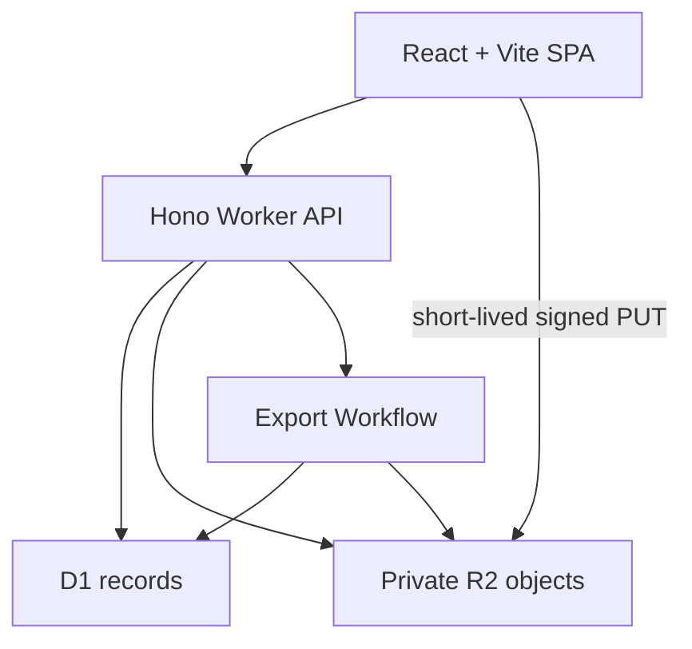
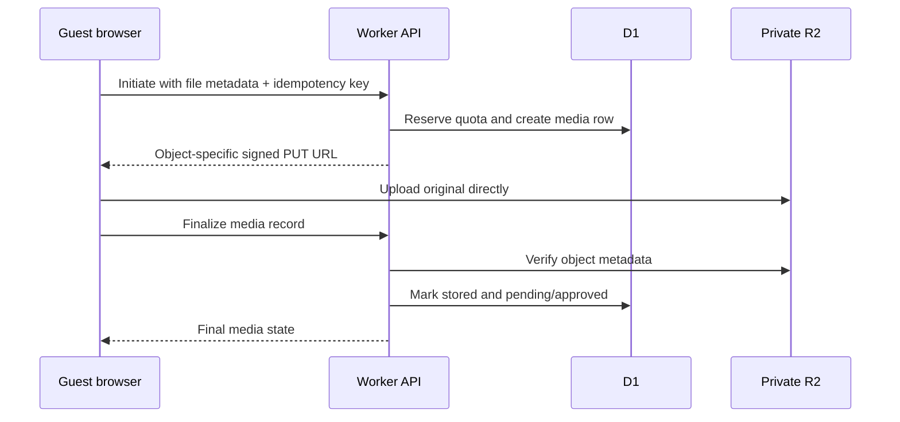

# Candidary Core — Workflow-Parity MVP Design

> **Historical baseline:** Later approved specifications supersede this document's guest hierarchy,
> account model, publication flow, limits, global palette, and event-appearance decisions. Use
> `docs/superpowers/specs/2026-07-22-wedding-photo-drop-design.md`,
> `docs/superpowers/specs/2026-07-28-host-account-hardening-design.md`,
> `docs/superpowers/specs/2026-07-29-event-theming-design.md`, and
> `design/design-system.md` as current authority. This file remains as the original architecture
> record.

**Date:** 2026-07-21

**Status:** Approved direction, written specification awaiting review

**Working name:** Candidary is an internal codename only and is not represented as trademark-cleared.

## 1. Decision Summary

Candidary Core will prove one complete private-photo workflow:

> A host creates a private event, shares a QR code or guest link, guests contribute images without accounts, the host approves or rejects those images, approved images appear in one gallery and full-screen view, and the host prepares a downloadable export.

The MVP targets workflow parity with the central event-photo collection loop, not feature parity with Guestpix's commercial product. It deliberately excludes albums, video, invitations, RSVP, separate guestbook infrastructure, paid plans, and public SaaS account management.

The implementation target is a React/Vite single-page application and Hono API on Cloudflare Workers, with D1 for records, private R2 storage for objects, and Cloudflare Workflows for ZIP exports.

Host ownership will use event-specific, high-entropy management links. There is no general host account or multi-event dashboard in this release. Guest access will use a separate high-entropy event link and QR code. Both links are exchanged for short-lived, HTTP-only event sessions before the user reaches the application screen.

## 2. Goals and Non-Goals

### Goals

- Deliver a useful end-to-end private event photo collection workflow.
- Keep guest participation account-free and mobile-first.
- Make moderation and object authorization correct before adding feature breadth.
- Keep permanent R2 object URLs private and inaccessible without authorization.
- Make uploads retryable and finalization idempotent.
- Make exports asynchronous, observable, retryable, and capped at a tested size.
- Reproduce the recognizable workflow while shipping an original brand, copy, visual system, and asset set.

### Non-Goals

- Video uploads, transcoding, video thumbnails, or resumable multipart uploads.
- Multiple galleries, albums, hidden albums, or album PINs.
- Invitation composition, guest-list management, RSVP questions, or RSVP reporting.
- A separate guestbook product. The MVP has lightweight guest messages only.
- Guest downloads of gallery media.
- Multi-event analytics or portfolio-level host reporting.
- Passwords, email magic links, social sign-in, co-hosts, or host account recovery.
- Billing, entitlements, storage plans, or differentiated retention tiers.
- Email or SMS delivery.
- Public feature-catalog pages beyond a compact landing page.
- Unlimited media or exports.

## 3. Actors and Authorization Boundary

### Host

The host holds a management link issued when an event is created. Opening the link exchanges its secret for a short-lived management session cookie and redirects to a clean URL. A management session can update the event's name, welcome message, cover, and three feature toggles; review media; moderate messages; rotate access links; start exports; and delete the event. The event date is immutable because it anchors the fixed retention lifecycle.

The raw management secret is never stored in D1. Only its keyed digest is stored. It is shown once after creation. Losing the link means losing self-service access in this MVP; the creation confirmation explicitly tells the host to save it. Account recovery is deferred. The guest share secret is additionally stored as application-encrypted ciphertext so an authorized manager can redisplay its link and QR code; its digest remains the value used for verification.

### Guest

The guest holds a shareable event link, normally reached through its QR code. Opening the link exchanges its secret for a short-lived guest session cookie and redirects to the event route without the secret in the address bar. A guest session can read the event shell, upload when enabled, view its own pending contributions, view approved media when the gallery is visible, and post a lightweight message.

Guests may enter a display name. The default name is stored locally in the browser and copied into each submitted media or message record. It is not an account identifier.

### Authorization invariant

Every event-scoped API request resolves an authenticated event session first and then compares the session's `event_id` and role against the requested resource. Client-supplied event or media identifiers never establish authorization on their own.

## 4. Product Surface

### Routes

| Route | Purpose | Access |
| --- | --- | --- |
| `/` | Compact original-branded landing page and create-event CTA | Public |
| `/create` | Event creation form | Public during controlled pilot |
| `/join/:token` | Guest-token exchange; immediately redirects | Guest secret |
| `/event/:slug` | Welcome, upload, messages, and approved gallery | Guest session |
| `/event/:slug/fullscreen` | Full-screen presentation of the approved gallery | Guest session |
| `/manage/:token` | Management-token exchange; immediately redirects | Management secret |
| `/manage/event/:eventId` | Event summary, share tools, settings, moderation, and exports | Management session |

The public creation endpoint is acceptable only for a controlled pilot. Before an unrestricted launch it must receive deployment-level abuse protection such as Cloudflare rate limiting and Turnstile. Those controls are launch requirements, not part of the core product validation.

### Host screens

1. **Create event:** name, date, welcome message, and cover image. Metadata creates the event first; cover upload then uses the new management session. A cover failure does not discard the event. The form states supported types and fixed limits before submission.
2. **Creation success:** management link, guest link, downloadable QR code, and a clear warning that the management link cannot be recovered in this MVP.
3. **Event manager:** event preview, links and QR, current media counts, settings, moderation queue, lightweight messages, and export status.
4. **Media review:** pending is the default filter; each item has approve, reject, and delete actions. Bulk approve and bulk reject operate only on the currently selected items.
5. **Export panel:** prepare export, queued/running/ready/failed status, snapshot timestamp, retry action, and temporary download action.

### Guest screens

1. **Event welcome:** cover image, event name/date, welcome message, optional display-name prompt, upload CTA, and current gallery availability.
2. **Upload tray:** file selection, per-file validation, progress, retry, cancel-before-transfer, completion receipt, and optional caption.
3. **My contributions:** the current guest session can see its own uploading, pending, approved, rejected, or failed items.
4. **Gallery:** approved images only, lazy-loaded, with empty/loading/error states.
5. **Full-screen mode:** the same approved gallery in a distraction-free viewer. It has no separate settings or persisted slideshow state.
6. **Messages:** a single chronological feed containing approved standalone notes and captions associated with approved images.

## 5. Visual Direction and Clean-Room Rules

Candidary's visual language will be deliberately distinct from Guestpix:

- Warm parchment surfaces, aubergine primary actions, apricot highlights, and moss status accents.
- Sans-forward editorial typography with compact display headings and highly legible body text.
- Original iconography from a licensed icon library and original generated or licensed event imagery.
- Restrained radii and shadows rather than reproducing Guestpix's component geometry.
- Original information architecture and copy, even when a workflow state corresponds to a captured source state.

Guestpix trademarks, logos, copy, screenshots, photographs, QR artwork, and proprietary assets are reference material only and must never enter shipped bundles, fixtures, seed data, or public documentation.

## 6. System Architecture

### Frontend

- React and TypeScript built with Vite and the Cloudflare Vite plugin.
- React Router for client-side routes; no server rendering is required.
- A small query layer owns API loading, mutation invalidation, and retry state.
- Upload state is modeled independently per file so one failure does not discard successful uploads.
- Browser storage is limited to display-name preference, a last-event convenience pointer, and non-secret UI preferences. Permanent guest or management tokens are not stored in `localStorage`.

### Worker API

- Hono routes provide request parsing, schema validation, session resolution, authorization, and stable error responses.
- Transactional batches and conditional updates protect quota reservations, upload finalization, moderation transitions, and export-job uniqueness.
- R2 remains private. Guests never receive permanent R2 read URLs.
- A scheduled Worker handler removes expired upload reservations and drives fixed-retention cleanup.

### Storage

- D1 stores event configuration, token digests, sessions, upload lifecycle, moderation state, messages, and export jobs.
- R2 stores cover images, original guest images, generated ZIP exports, and short-lived partial export objects.
- Object keys are generated server-side and contain random identifiers, never guest filenames or access tokens.

### Export execution

- Cloudflare Workflows runs durable export jobs.
- A Workflow snapshots eligible media, streams approved originals into a ZIP, writes a metadata CSV, uploads the result to R2, and updates the job state.
- A ready export is downloaded through a short-lived signed GET URL available only to a valid management session.

## 7. Session and Token Design

### Token shape

- Guest and management secrets contain at least 192 bits of cryptographically secure randomness.
- Links contain a public token identifier and secret component.
- D1 stores the token identifier and an HMAC digest of the secret, not the raw secret.
- Guest rows also store AES-GCM ciphertext of the guest secret so a manager can redisplay and download the share link and QR code. Management secrets have no ciphertext and remain one-time display values.
- Tokens have a role (`guest` or `manager`), event scope, expiry, and revocation timestamp.

### Exchange

1. The exchange route parses the public identifier and secret.
2. The Worker applies constant-time digest comparison, expiry checks, revocation checks, and event-deletion checks.
3. The Worker creates an `event_sessions` record and sets a cookie containing a public session identifier and separate random secret. D1 stores only the session-secret digest.
4. The cookie is `HttpOnly`, `Secure`, and `SameSite=Lax` and is scoped to the application origin.
5. The response redirects to a token-free route and sets `Referrer-Policy: no-referrer`.

### Session lifetime and revocation

- Guest sessions last seven days or until the guest token expires, whichever occurs first.
- Management sessions last twelve hours or until the management token expires, whichever occurs first.
- Session lookup checks the backing token on every authenticated request, so revoking a token invalidates its sessions immediately.
- Rotating the guest link revokes the current guest token and all guest sessions before issuing a replacement.
- The management token may be rotated from an active management session. The replacement link is displayed once.

### Fixed retention

- Guest access expires 30 days after the event date, with a minimum of 30 days from creation.
- Management access expires 90 days after the event date, with a minimum of 90 days from creation.
- Event objects and dependent records are purged 120 days after the event date, with a minimum of 120 days from creation.
- The manager UI shows these dates. There are no tier-specific exceptions in the MVP.

## 8. Data Model

The MVP uses six tables. There is no `hosts` table because event-specific management possession is the ownership mechanism.

### `events`

| Field | Notes |
| --- | --- |
| `id` | UUID primary key |
| `slug` | Non-secret, unique display route identifier |
| `name` | 1–80 characters |
| `event_date` | Calendar date |
| `welcome_message` | 1–500 characters |
| `cover_object_key` | Nullable private R2 object key |
| `uploads_enabled` | Boolean |
| `gallery_visible` | Boolean |
| `moderation_required` | Boolean |
| `reserved_media_count` | Counter used by conditional quota reservation |
| `stored_media_count` | Counter for pending and approved originals |
| `reserved_bytes` | Declared bytes held by active reservations |
| `stored_bytes` | R2-confirmed original bytes |
| `guest_access_expires_at` | Fixed lifecycle timestamp |
| `management_access_expires_at` | Fixed lifecycle timestamp |
| `purge_after` | Fixed lifecycle timestamp |
| `created_at` | Timestamp |
| `deleted_at` | Nullable timestamp; denies access immediately |

Guest downloads are hard-disabled in the MVP, so there is no dormant `guest_downloads_enabled` setting.

### `event_access_tokens`

| Field | Notes |
| --- | --- |
| `id` | Public token identifier |
| `event_id` | Foreign key |
| `role` | `guest` or `manager` |
| `secret_digest` | HMAC digest |
| `secret_ciphertext` | Guest token only; AES-GCM ciphertext for manager-authorized redisplay |
| `expires_at` | Timestamp |
| `revoked_at` | Nullable timestamp |
| `created_at` | Timestamp |

### `event_sessions`

| Field | Notes |
| --- | --- |
| `id` | Public random session identifier |
| `secret_digest` | HMAC digest of the separate cookie secret |
| `event_id` | Foreign key |
| `access_token_id` | Foreign key |
| `role` | `guest` or `manager` |
| `expires_at` | Timestamp |
| `revoked_at` | Nullable timestamp |
| `created_at` | Timestamp |

### `media`

| Field | Notes |
| --- | --- |
| `id` | UUID primary key |
| `event_id` | Foreign key |
| `uploader_session_id` | Guest-session foreign key |
| `object_key` | Server-generated private R2 key |
| `original_filename` | Sanitized for display and export only |
| `mime_type` | Validated supported MIME type |
| `declared_byte_size` | Client-declared reservation size |
| `byte_size` | R2-confirmed size after upload |
| `width`, `height` | Dimensions parsed by the Worker from the object header during finalization |
| `guest_name` | Snapshot of optional display name |
| `caption` | Nullable, up to 300 characters |
| `upload_state` | `reserved`, `stored`, `failed`, or `deleted` |
| `moderation_status` | `pending`, `approved`, or `rejected` |
| `idempotency_key` | Unique within the event/session initiation scope |
| `reservation_expires_at` | Cleanup timestamp for incomplete uploads |
| `created_at` | Timestamp |
| `approved_at` | Nullable timestamp |
| `deleted_at` | Nullable timestamp |

### `guest_messages`

| Field | Notes |
| --- | --- |
| `id` | UUID primary key |
| `event_id` | Foreign key |
| `guest_session_id` | Foreign key |
| `guest_name` | Optional display-name snapshot |
| `body` | 1–500 characters |
| `moderation_status` | `pending`, `approved`, or `rejected` |
| `created_at` | Timestamp |
| `approved_at` | Nullable timestamp |

When moderation is disabled, newly finalized media and new messages become approved immediately. When it is enabled, both begin pending.

### `export_jobs`

| Field | Notes |
| --- | --- |
| `id` | UUID primary key |
| `event_id` | Foreign key |
| `state` | `queued`, `running`, `ready`, `failed`, or `expired` |
| `snapshot_at` | Approval cutoff for deterministic contents |
| `object_key` | Nullable completed ZIP object key |
| `media_count` | Snapshot count |
| `total_bytes` | Snapshot size |
| `attempt` | Retry counter |
| `error_code` | Nullable stable failure code |
| `created_at`, `started_at`, `completed_at`, `expires_at` | Lifecycle timestamps |

Only one queued or running export is permitted per event. A retry keeps the same logical job, increments `attempt`, deletes any partial object, and writes to an attempt-specific temporary key before publishing the final key.

## 9. Upload Workflow

### Initiation

- The browser rejects unsupported files and declared oversize files before calling the API.
- The API confirms a valid guest session, `uploads_enabled`, event capacity, supported MIME type, and idempotency key.
- A transactional D1 batch conditionally increments the event reservation counters and inserts a `reserved` media row. The conditional update succeeds only when the resulting count and byte total stay within the event limits.
- The API returns a signed, object-specific R2 `PUT` URL valid for ten minutes. The signature binds the generated key and content type.

### Transfer

- The browser uploads directly to R2 and reports byte progress where the browser transport exposes it.
- Each file progresses independently. Retry reuses the original initiation response while its URL remains valid or requests a new URL for the same media row after expiry.
- The guest cannot choose the R2 key.

### Finalization

- Finalization is idempotent for a media ID.
- The API uses R2 object metadata to verify existence and byte size, then reads the leading object bytes to verify the JPEG, PNG, or WebP signature and parse dimensions. The verified signature must agree with the signed content type.
- An object that exceeds the declared size or fixed limit is deleted and the media row becomes failed.
- A successfully stored object becomes pending when moderation is required and approved otherwise.
- Finalization atomically moves the event's declared reservation counters to confirmed stored counters.
- A reserved row is never eligible for moderation, gallery delivery, or export.
- A scheduled cleanup deletes objects and releases reservations for rows still reserved after fifteen minutes.

### Limits

- Accepted MIME types: `image/jpeg`, `image/png`, and `image/webp`.
- HEIC/HEIF, GIF, SVG, RAW formats, and all video are rejected with a clear explanation.
- Maximum image size: 10 MiB.
- Maximum approved plus pending media: 50 images per event.
- Maximum stored original bytes: 300 MiB per event.
- Maximum one active upload per guest session at a time; the UI queues additional selected files.

Cover images use the same three MIME types, have a 10 MiB limit, do not consume the 50-image or 300 MiB guest-media allowance, and are uploaded through an object-specific signed PUT authorized by a management session. Replacing a cover publishes the new key before deleting the old object.

These limits are product constraints, not pricing tiers.

## 10. Moderation, Gallery, and Messages

### Media state rules

- Only `stored` media can transition among pending, approved, and rejected.
- Approval records `approved_at`; rejection clears it.
- Re-approving a rejected item is permitted from the manager UI.
- Delete marks the record inaccessible and atomically decrements the event's stored counters before object removal. All content endpoints deny access as soon as `deleted_at` is set.
- A guest sees status metadata for its own stored contributions regardless of moderation state, but no other guest's pending or rejected media.

### Gallery rules

- When `gallery_visible=false`, guests see no shared gallery; uploads and their own receipts can remain available.
- When visible, the gallery query returns only stored, approved, non-deleted media.
- Full-screen mode uses the same query and authorization. It is a view mode, not a separate data subsystem.
- The guest gallery refreshes when the tab regains focus and on a modest polling interval while full-screen mode is active.

### Media delivery

R2 reads go through an authorization-checking Worker endpoint. The endpoint validates the event session and current media state on every request, then streams the private object. Guest reads require approved, stored, non-deleted media, except that an uploader may also read its own pending media. Rejected bytes are denied even to the uploader, although the uploader still sees the rejected status. Manager reads allow all stored moderation states.

This choice intentionally avoids long-lived or temporarily valid read URLs that could continue working after rejection or deletion.

### Messages

- Guests can add one caption per upload and can post standalone notes to a single feed.
- Moderation mirrors media moderation to avoid a second policy surface.
- Guests see their own pending notes; the shared feed contains approved notes only.
- The manager can approve, reject, or delete notes.
- The feed query combines standalone `guest_messages` with captions read from approved `media` rows; captions are not duplicated into the messages table.

## 11. Export Workflow

1. A manager selects **Prepare download**.
2. The API calculates a snapshot of approved, stored, non-deleted media at `snapshot_at`.
3. If the snapshot is empty or exceeds the 300 MiB event ceiling, the request returns a stable explanatory error without creating a Workflow.
4. The API creates one queued job and starts a Workflow instance keyed by job ID.
5. The Workflow marks the job running, streams each snapshotted original into a ZIP, adds `media.csv`, writes to an attempt-specific R2 key, and publishes the completed object key.
6. The manager polls job state and may leave the page without cancelling the job.
7. Ready exports remain available for 24 hours. A valid manager can request a signed download URL valid for fifteen minutes.
8. A failed job exposes a safe error summary and retry action. Retry removes partial objects and increments the attempt.

`media.csv` contains media ID, original filename, guest display name, caption, MIME type, byte size, dimensions, upload timestamp, and approval timestamp. The ZIP contains approved originals only. Filenames are collision-safe and path-sanitized.

An export is a snapshot. Images approved after `snapshot_at` require a new export.

## 12. Event Deletion and Cleanup

Deleting an event requires an exact-name confirmation in the manager UI.

1. The API marks `events.deleted_at` and revokes all access tokens and sessions in one transactional batch.
2. All application and content endpoints begin returning an event-deleted response immediately.
3. A cleanup Workflow deletes cover, media, export, and partial objects from R2.
4. After the ten-minute maximum signed-PUT lifetime has elapsed, the Workflow performs a final event-prefix sweep so a late upload cannot leave an orphan.
5. The Workflow deletes dependent D1 records after the final object cleanup succeeds.
6. If cleanup fails, the event remains inaccessible and the job retries safely.

The daily scheduled cleanup applies the same path to events whose `purge_after` timestamp has passed. The MVP does not promise recovery after explicit deletion or automatic purge.

## 13. API Error Contract

All API failures use a stable JSON shape with `code`, human-safe `message`, optional field errors, and a request identifier. Expected codes include:

- `EVENT_NOT_FOUND`, `EVENT_DELETED`, and `EVENT_EXPIRED`
- `SESSION_REQUIRED`, `SESSION_EXPIRED`, and `ROLE_FORBIDDEN`
- `UPLOADS_DISABLED`, `GALLERY_HIDDEN`, and `TOKEN_REVOKED`
- `FILE_TYPE_UNSUPPORTED`, `FILE_TOO_LARGE`, `EVENT_MEDIA_LIMIT`, and `EVENT_STORAGE_LIMIT`
- `UPLOAD_RESERVATION_EXPIRED`, `UPLOAD_OBJECT_MISSING`, and `UPLOAD_FINALIZE_CONFLICT`
- `MEDIA_STATE_CONFLICT`
- `EXPORT_ALREADY_ACTIVE`, `EXPORT_EMPTY`, `EXPORT_LIMIT_EXCEEDED`, and `EXPORT_FAILED`

The UI maps these codes to actionable states. Unknown errors use a generic retry message and preserve the request identifier for logs.

## 14. Security and Privacy Requirements

- Access and session secrets are generated with Web Crypto and never logged.
- D1 stores token and session-secret digests rather than reusable raw secrets. The guest share secret is the sole exception: it is also stored as AES-GCM ciphertext for manager-authorized redisplay, using a key separate from the digest key.
- Cookies are HTTP-only, secure, same-site, and protected against cross-site state changes with origin checks and CSRF tokens where needed.
- Every write validates session role, event scope, event lifecycle, and current resource state.
- D1 statements are parameterized; rendered guest text is escaped and never interpreted as HTML.
- Upload keys and filenames cannot contain guest-controlled paths.
- Signed R2 PUT URLs are object-specific, content-type-bound, and valid for ten minutes.
- R2 CORS permits signed uploads only from the deployed application origin and only with the required methods and headers.
- The R2 bucket has no public development URL or custom public domain.
- Media read responses use private caching rules and `nosniff`; application pages use a restrictive content security policy and `Referrer-Policy: no-referrer`.
- Deleted or rejected media is denied by the Worker immediately, including previously used content endpoint URLs.
- Logs exclude tokens, cookie values, captions, welcome messages, and filenames. They retain request IDs, stable error codes, durations, and opaque record IDs.

## 15. Reliability and Failure States

- Repeating upload initiation with the same idempotency key returns the same active reservation rather than creating a duplicate.
- Repeating finalize returns the already-finalized result when metadata matches and a conflict when it does not.
- Refreshing during upload leaves a reserved row that is never visible or exportable and is cleaned after expiry.
- Client cancellation before transfer releases the reservation; cancellation after transfer asks the API to delete the object.
- One failed file does not roll back successful files in the same selection.
- Moderation mutations use conditional state updates to prevent stale double actions.
- Export creation has a unique active-job constraint; retries use attempt-specific keys.
- Network errors preserve enough client state to retry without silently duplicating uploads.
- Empty, loading, expired, revoked, deleted, quota-full, partial-upload, export-failed, and offline states have explicit UI treatments.

## 16. Testing and QA Strategy

### Automated tests

- Unit tests for token digest verification, expiry calculations, filename sanitization, CSV generation, error mapping, and state-transition guards.
- Worker integration tests with local D1 and R2 bindings for event isolation, role enforcement, upload initiation/finalization, immediate media revocation, quota reservation, idempotency, and deletion.
- Workflow tests for snapshot determinism, retry behavior, partial-object cleanup, ready expiry, and valid ZIP structure.
- React component tests for validation, progress, retry, moderation actions, empty states, and keyboard behavior.
- End-to-end tests for the complete host → guest → moderation → gallery → export journey in desktop and narrow mobile viewports.

### Required security assertions

- A management session for event A cannot read or mutate event B by changing any identifier.
- A guest session cannot reach management APIs.
- A guest token or session is valid for one event only.
- Guests cannot read another guest's pending or rejected media.
- R2 objects cannot be read through permanent unauthenticated URLs.
- Revoked or expired access tokens invalidate existing sessions.
- Rejected or deleted media fails through a previously used Worker content URL.

### Visual and interaction QA

- Compare implemented states to the clean-room source captures for workflow completeness, then judge Candidary's original visual system on its own consistency.
- Test at representative narrow mobile, tablet, and desktop widths using touch and keyboard input.
- Verify focus order, visible focus, labels, error association, dialog focus trapping, reduced motion, color contrast, and full-screen exit behavior.
- Exercise empty, loading, success, validation, partial failure, offline, expired-session, and destructive-confirmation states.
- Run console, network, and accessibility checks with no unexplained errors.

## 17. Acceptance Criteria

### Primary journey

- A host creates an event and receives a guest link, one-time management link, and downloadable QR code.
- A guest opens the guest link without creating an account and lands on a token-free event URL.
- A guest can upload supported images and see queued, progress, completion, retry, and failure states.
- Pending media is visible to its uploader and manager but never to other guests.
- Approved media appears in the shared gallery and full-screen view.
- Rejected or deleted media cannot be retrieved through an old content endpoint URL.
- A manager prepares and downloads a valid ZIP containing approved originals and `media.csv`.

### Authorization

- Identifier changes never cross event boundaries.
- Guest sessions cannot perform management actions.
- Rotated, revoked, expired, and deleted-event links stop working according to the defined lifecycle.
- The R2 bucket remains private and every guest media read is authorized by the Worker.

### Reliability

- Initiation and finalization retries do not create duplicate media records.
- Incomplete uploads never become approved or exportable.
- Unsupported and oversized files fail before a usable media record is committed; malicious oversize uploads are removed during finalization or reservation cleanup.
- Failed exports can be retried without conflicting jobs or leaked partial objects.
- Explicit deletion and fixed-retention purge both deny access immediately and clean D1/R2 state asynchronously.

### Clean-room and quality

- No Guestpix branding, copy, screenshots, or proprietary assets ship.
- The guest workflow works at narrow mobile widths with touch input.
- Upload, moderation, gallery, full-screen, and export actions are keyboard operable.
- Empty, loading, error, expired, and partial-failure states are represented.

## 18. Deployment and Configuration

Required Cloudflare resources:

- One Worker application serving the SPA and Hono API.
- One D1 database.
- One private R2 bucket.
- One export Workflow binding.
- One scheduled trigger for reservation and retention cleanup.
- Separate secrets for token/session HMAC, guest-token encryption, and R2 presigning credentials.

Local development uses Wrangler/Cloudflare Vite emulation with separate local D1 and R2 data. Production secrets are never committed. A deployment is not considered ready for unrestricted public event creation until rate limiting and bot protection are configured.

## 19. Deliberate Follow-On Order

Only after Candidary Core passes the acceptance criteria should additional systems be considered. The recommended sequence is:

1. Host account recovery or email magic-link identity.
2. Multiple events and a minimal event list.
3. Guest media downloads, if privacy policy is validated.
4. Albums and their authorization model.
5. Invitations and RSVP as a separate product slice.
6. Video ingestion and multipart/resumable upload as a separate infrastructure slice.

## 20. Source References

- [Guestpix workflow overview](https://help.guestpix.com/article/153-start-here-welcome-to-guestpix)
- [Cloudflare React + Vite full-stack guide](https://developers.cloudflare.com/workers/framework-guides/web-apps/react/)
- [Cloudflare R2 presigned URLs](https://developers.cloudflare.com/r2/api/s3/presigned-urls/)
- [Cloudflare R2 upload guidance](https://developers.cloudflare.com/r2/objects/upload-objects/)
- [Cloudflare Workflows](https://developers.cloudflare.com/workflows/)

These references support workflow and platform decisions only. They do not authorize copying branded text, visual assets, or proprietary implementation details.

