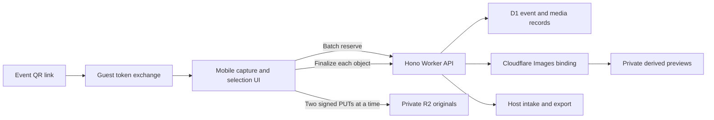

# Candidary Wedding Photo Drop Design

**Date:** 2026-07-22

**Status:** Approved direction; written specification awaiting review

> **Supersession note (2026-07-31):** `2026-07-30-event-rsvp-and-photo-entry-design.md` broadens the
> guest surface this document describes. Before the event the same URL now opens a household RSVP,
> and on the day it opens the photo drop below; a secondary disclosure carries RSVP once photos are
> primary. The QR itself changed too: guest access is one permanent printed entry credential carried
> in a URL fragment, not the rotatable guest link described here.
>
> Everything this document says about the photo journey remains authoritative and unchanged: the
> required guest name, camera-or-library entry, review, explicit send, per-file progress and retry,
> and the terminal delivered receipt that hides every secondary section. RSVP never became a
> prerequisite for sending photos, and `GuestUploadFlow` is not an RSVP state controller.

## 1. Decision

Candidary is a private event photo drop first. At a wedding or other large party, a guest scans the event QR code, enters one required name, takes a new photo or chooses recent photos, reviews the selection, and sends the originals directly to the host. The journey ends with an unambiguous delivery receipt.

The gallery, guest notes, and publication moderation remain in the product, but they are secondary. They must never compete with, interrupt, or become prerequisites for the core upload journey.

This specification supersedes the guest-flow, media-limit, moderation-semantics, and export-selection decisions in `2026-07-21-candidary-core-design.md` and its implementation plan wherever they conflict. Existing token security, event lifecycle, private R2 storage, and host-link ownership remain in force.

## 2. Goals

- Make a first-time guest understand the event and reach the camera or recent-photo picker immediately on a phone.
- Require exactly one identity field: the guest's display name.
- Preserve every successfully delivered original for the host.
- Support JPEG, PNG, WebP, HEIC, and HEIF photos from current phones.
- Remain reliable on inconsistent reception with visible per-photo state and safe retries.
- Support one event with 500 guests, 10,000 photos, and 100 GiB of originals.
- Keep optional gallery publication, notes, and moderation available without centering them.
- Provide concrete mobile-device, privacy, performance, and load evidence before declaring the application wedding-ready.

## 3. Non-goals

- Video ingestion or transcoding.
- Guest accounts, passwords, invitations, RSVP, billing, or a multi-event host account system.
- Automatic background delivery after the browser page has been closed.
- Making the shared gallery visible by default.
- Requiring hosts to moderate photos before they can view, retain, or export them.
- Hiding an upload failure behind an optimistic success screen.

## 4. Product hierarchy

### Private collection

Every finalized, non-deleted photo belongs immediately to the host's private collection. Delivery and publication are separate states. A photo does not need publication approval before the host can view or export it.

The host export defaults to all stored, non-deleted originals. Publication status never removes a stored original from the private collection.

### Optional gallery and notes

The shared gallery is disabled by default. When a host enables it, publication controls determine which derived previews guests may see. Hiding a photo from the gallery does not delete the private original.

Guest notes remain available from secondary event navigation. Neither notes nor the gallery appears as a prompt during selection, transfer, or the terminal receipt.

### Host manager

The event manager opens on live intake rather than moderation. Its primary surface contains:

- guest link and downloadable QR code;
- upload-open status and event capacity;
- total and recent deliveries;
- search and filtering by required guest name;
- access to all private originals; and
- preparation and download of the complete export.

Gallery publication, notes, link rotation, retention, and event settings remain separate secondary sections.

## 5. Mobile guest journey

### 5.1 Entry

The QR code contains the existing high-entropy guest exchange link. Exchange creates a guest session, removes the secret from the address bar, and redirects to the event route.

The first mobile viewport contains only the information and controls needed to act:

- host or event identity;
- a short invitation to contribute;
- one required **Your name** field;
- primary **Take a photo** action; and
- secondary **Choose recent photos** action.

There is no account prompt and no primary navigation competing with these controls.

### 5.2 Required name

The display name is trimmed, required, and between 1 and 80 characters. It is stored locally as a convenience and copied into every media record as a snapshot. It is not an account identifier.

On later visits from the same browser, the page shows a compact **Sending as {name}** treatment with an edit action. A blank or invalid name prevents either photo source from opening and focuses an inline error on the name field.

### 5.3 Camera and library

**Take a photo** uses a camera-oriented file input with an environment-camera hint. When a browser cannot honor the hint, it falls back to the device's normal image chooser. Cancelling the camera returns to the entry state without an error.

After a capture, the returned photo enters the shared selection tray already selected and labeled as newly taken. The guest may remove or retake it.

**Choose recent photos** uses the normal multi-select image library. It can start a selection or append images to a newly captured photo. Both sources feed the same queue.

### 5.4 Review and send

The selection tray shows thumbnails where the browser can render them, the selected count, any per-file validation issue, and the remembered guest name. The guest may add recent photos, remove files, or tap **Send {count} photo(s)**.

Nothing uploads before the explicit Send action. The client chunks a large selection into internal reservation batches and transfers at most two photos concurrently. These implementation details are not exposed as guest-facing limits.

### 5.5 Progress and terminal receipt

Each photo has its own reserving, queued, uploading, finalizing, delivered, or failed state. Successfully delivered photos never roll back because another item failed.

The terminal receipt appears only when:

1. at least one photo from the current send attempt is server-confirmed as delivered; and
2. every other selected photo is either delivered or explicitly removed by the guest.

The receipt states the exact delivered count, the destination event, and: **You're all done and can close this page.** It contains no gallery prompt, note prompt, redirect, or additional primary action. A guest who wants to contribute later can scan or reopen the event link; the name remains remembered.

## 6. Architecture and data flow

### Reservation

The client sends file metadata, required guest name, a send-attempt identifier, and stable per-file idempotency keys. It chunks large selections into batches of no more than 20 files.

The API validates the guest session, event lifecycle, upload-open state, filename, declared type, size, event quota, and idempotency key. A transactional D1 batch reserves capacity and creates accepted media rows. If the remaining event quota cannot hold the entire valid batch, files are accepted in the guest's selection order until either quota is exhausted; later items receive a stable per-file capacity error. The response gives each accepted item an object-specific signed R2 PUT URL. A rejected item does not invalidate accepted siblings.

### Transfer

The browser uploads directly to private R2 using server-generated unique object keys. At most two transfers run concurrently per guest device. Different guests upload independently. No guest controls an object key or receives a permanent read URL.

An expired signed URL is refreshed for the same reservation and idempotency key. A retry never creates a duplicate media record.

### Finalization

Finalization verifies the R2 object exists, confirms its actual size and image format, records dimensions, and changes the media row from reserved to stored exactly once. Only that stored transition counts as delivery.

Preview generation is requested after finalization and may complete asynchronously. The authorized preview endpoint also generates and caches a missing preview on demand, so a failed background attempt is recoverable.

## 7. Media formats and derived previews

Accepted originals are:

- JPEG (`image/jpeg`);
- PNG (`image/png`);
- WebP (`image/webp`);
- HEIC (`image/heic` and `image/heic-sequence`); and
- HEIF (`image/heif` and `image/heif-sequence`).

The maximum original size is 20 MB. A browser may provisionally submit a `.heic` or `.heif` file with an empty, vendor-specific, or `application/octet-stream` type, but finalization accepts it only when container inspection identifies HEIC or HEIF. Validation never trusts the extension or client MIME type by itself. A sequence preview uses its first still frame while the private original remains untouched.

The untouched original remains in private R2. An Images binding reads the authorized private R2 stream and produces a browser-compatible WebP or JPEG preview. This makes HEIC/HEIF usable in the host manager and optional gallery without replacing the original. Derived previews must not expose original EXIF metadata.

If preview generation fails, the original remains delivered and exportable. The manager shows a safe preparing-preview or preview-failed state with retry; preview failure does not become upload failure.

## 8. State and persistence changes

Media retains an upload lifecycle of `reserved`, `stored`, `failed`, or `deleted`.

Publication becomes a separate field named `publication_status` with values `unpublished`, `published`, or `hidden`. Existing rows migrate as follows:

- `pending` to `unpublished`;
- `approved` to `published`; and
- `rejected` to `hidden`.

The previous moderation field is removed after migration. Gallery queries return only stored, non-deleted, published media. Host collection and export queries return all stored, non-deleted media regardless of publication status.

Stored media requires a non-empty `guest_name`. Before that constraint is installed, existing null or blank names are backfilled as `Guest (legacy upload)` so deployed pilot data remains valid and visibly distinguishable from newly named contributions. A nullable `preview_object_key` tracks a cached derived preview without changing the original object key.

## 9. Scale and quotas

One event supports:

- 500 active guest sessions;
- 10,000 stored photos;
- 100 GiB of stored originals; and
- 20 MB per original.

The UI must not retain the current 50-photo or 300-MiB pilot language. The manager shows event-level capacity; guests see a capacity error only if the event is actually full.

Batch reservation reduces repeated event-counter writes. Direct-to-R2 transfers keep image bytes off the Worker request path. Load testing must exercise bursts, not just sequential creation of 10,000 database rows.

## 10. Error and recovery behavior

- A camera cancellation makes no state change and shows no error.
- Unsupported, corrupt, or oversized photos fail individually before or during finalization; valid siblings remain selected or delivered.
- Transient network and R2 failures receive bounded exponential retries before a manual Retry action appears.
- Manual retry reuses the same logical media reservation or refreshes it without duplication.
- In a partial failure, delivered photos remain locked as delivered while failed photos offer Retry or Remove.
- Removing the last undelivered failure permits a receipt for the exact number already delivered.
- Removing every item before any delivery returns to the entry state and does not show a receipt.
- Closing or refreshing the page cannot claim success for unfinished files. Completed contributions can be reloaded from the guest session, but local file bytes that were not delivered must be selected again.
- Expired reservations and orphaned objects are cleaned automatically.
- Paused uploads, expired or rotated links, deleted events, and exhausted event capacity use stable actionable messages.

## 11. Privacy and authorization

The existing event-scoped guest and manager sessions remain the authorization boundary. Every media and preview request resolves the session, event, role, lifecycle, and current media state.

Guests cannot enumerate or read the host's private collection. Guest access to a photo is limited to an optional published-gallery preview and the current uploader's own contribution status. Originals are never guest-readable.

Host exports contain originals and a manifest with the snapshotted guest name, original filename, type, size, dimensions, upload time, and publication status. Raw tokens, cookie values, and guest-supplied text remain excluded from logs.

## 12. Export behavior

**Prepare download** snapshots every stored, non-deleted original by default. The export Workflow partitions the snapshot into numbered ZIP archives whose source payload is capped at 2 GiB per part. This avoids one enormous archive and preserves broad ZIP-tool compatibility.

The export set contains:

- `candidary-export-manifest.csv` describing every part and photo;
- numbered archives such as `photos-001.zip`; and
- the untouched original bytes with collision-safe, path-sanitized filenames.

All parts belong to one logical export job and share one snapshot timestamp. The manager reports aggregate progress, individual ready parts, failures, and retry state. Ready parts use short-lived manager-only download URLs and retain the existing export-expiry policy.

## 13. Performance and accessibility requirements

- Event identity, required name, Take a photo, and Choose recent photos fit within a 390-by-844 CSS-pixel mobile viewport without horizontal scrolling.
- A returning guest reaches the camera with one tap after the QR exchange completes.
- The uncached event page becomes interactive within 2.5 seconds on a representative mid-range phone at 4 Mbps downstream, 1 Mbps upstream, and 100 ms round-trip latency. Upload duration is reported separately because it depends on photo size and upstream bandwidth.
- Touch targets are at least 44 by 44 CSS pixels.
- Progress and errors do not rely on color alone and are announced to assistive technology without stealing focus.
- Focus returns predictably after camera or picker cancellation, file removal, validation errors, and retry.
- Reduced-motion preferences are honored.

## 14. Verification strategy

### Automated

- Unit tests cover name validation, file classification, queue transitions, batching, retry backoff, exact receipt counts, and error mapping.
- Worker integration tests cover required-name enforcement, batch reservation, event quota, idempotency, actual HEIC/HEIF/JPEG/PNG/WebP validation, finalization, publication separation, preview authorization, private originals, cleanup, and partitioned exports.
- Browser tests cover first-visit and returning-name flows, camera-input fallback, library multi-select, capture-plus-recents, partial failure, Retry, Remove, terminal receipt, secondary feature hierarchy, keyboard use, and narrow-mobile layout.
- Security tests prove guests cannot enumerate or read private originals and publication changes do not affect host retention or export.
- Load tests create 500 guest sessions and a 10,000-photo lifecycle with burst reservation, concurrent unique-key transfers, finalization retries, preview generation, and partitioned export preparation.

### Physical-device acceptance

Current iPhone Safari and Android Chrome must each complete:

1. QR scan and token-free event entry;
2. required-name entry;
3. Take a photo and return to selection;
4. append recent photos;
5. send over normal and intentionally degraded reception;
6. recover one partial failure; and
7. reach the terminal receipt with the correct count.

Desktop browser emulation is supplementary and cannot replace these device checks.

### Production-like rehearsal

Before real wedding use, a staging or controlled-production rehearsal verifies printed QR reachability, camera permissions, R2 CORS, Images binding availability, weak reception, host live intake, privacy boundaries, link rotation, export parts, monitoring, and cleanup.

## 15. Acceptance criteria

- A first-time guest can understand the event, enter one required name, and open the camera from the first mobile viewport.
- A newly captured photo returns selected, and recent photos can be appended before one explicit Send action.
- Every private original is tagged with the required guest name and becomes host-visible immediately after server finalization.
- No receipt appears while any selected photo remains unresolved.
- The terminal receipt contains no competing gallery, note, or upload actions.
- Gallery publication, notes, and moderation remain available as secondary features.
- Publication status never blocks host viewing or the default all-original export.
- HEIC and HEIF originals are accepted, preserved, previewed in a cross-browser format, and exported untouched.
- One event passes the approved 500-guest, 10,000-photo, and 100-GiB design target.
- Real iPhone and Android evidence, load evidence, privacy evidence, and a production-like rehearsal all pass before the application is described as wedding-ready.

## 16. Platform references

- [Cloudflare Images binding](https://developers.cloudflare.com/images/optimization/binding/)
- [Cloudflare Images limits and formats](https://developers.cloudflare.com/images/get-started/limits/)
- [Cloudflare HEIC support](https://developers.cloudflare.com/changelog/post/heic-support/)
- [Cloudflare R2 limits](https://developers.cloudflare.com/r2/platform/limits/)
- [Apple: Explore media formats for the web](https://developer.apple.com/videos/play/wwdc2023/10122/)
