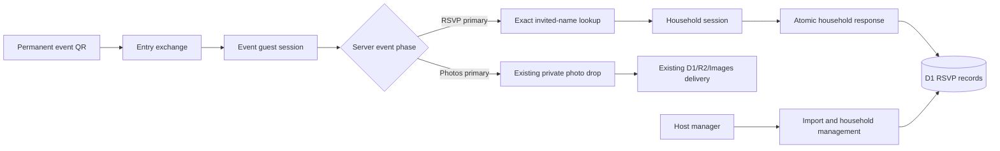

# Candidary Event RSVP and Photo Entry Design

**Date:** 2026-07-30

**Status:** Approved for implementation

## 1. Decision

Candidary will launch with one durable event QR that serves two phases of the
same wedding journey:

1. before the RSVP deadline, it helps invited households submit attendance; and
2. on the wedding day, it opens the existing private photo drop.

Every invitation and event-day sign uses the same event-wide QR. Households do
not receive unique QR codes or invitation codes. A respondent finds their
household by entering the full name of a named invitee.

Hosts preload households, named invitees, and permitted plus-one slots. A
respondent records an individual attending or not-attending choice for every
member and slot in that household. The RSVP collects attendance only.

This is the first supported Candidary product shape. No current event or RSVP
data needs to be migrated. The D1 database may be reset during implementation
after the exact target is verified.

## 2. Goals

- Let one household member RSVP for themselves and every person covered by the
  invitation.
- Give the host exact invited, attending, declined, and awaiting-response
  counts.
- Keep the invitation workflow mobile-first and short.
- Preserve one permanent QR from invitation printing through photo collection.
- Allow a household to revise its response until a host-set deadline.
- Keep the existing private photo journey as the event-day primary experience.
- Prevent guest-list browsing and make name lookup resistant to enumeration.
- Support approximately 500 invited guests without requiring guest accounts.
- Give the host manual and CSV-based roster management plus an RSVP export.
- Treat launch verification, physical QR rehearsal, and abuse controls as
  separate requirements from deployment success.

## 3. Non-goals

- Meal selection, dietary questions, or accessibility questionnaires.
- Seating charts or table assignments.
- Guest accounts, passwords, email verification, or phone verification.
- Email or text invitation delivery and automated RSVP reminders.
- Unique household QR codes or household invitation codes.
- Self-registration for people who were not invited.
- Waitlists or approval workflows for extra guests.
- Video uploads or changes to the approved photo-delivery contract.
- Compatibility shims, backfills, or dual-read behavior for current D1 data.

## 4. Product states and QR permanence

### 4.1 Durable event entry

Event creation produces one random, high-entropy entry credential and its QR.
The credential is not a guessable event slug. Scanning it exchanges the
credential for a short-lived event guest session, removes the credential from
the address bar, and redirects to the clean event route.

The credential is carried in the event link's URL fragment. The join page reads
it into memory, removes the fragment before exchange, and sends it in a
same-origin POST body. URL fragments are not sent in HTTP requests or referrers,
so normal edge/application request logs never receive the raw printed secret.

The printed credential remains stable for the event's lifetime. Normal session
expiry, session-secret rotation, and internal credential maintenance do not
change the QR.

A permanent printed credential cannot be secretly replaced after printing. If
the QR leaks, the host may pause RSVP, pause uploads, or emergency-disable the
printed entry. Emergency disable explicitly warns that every printed QR will
stop working.

### 4.2 Phase priority

The server exposes the current event phase; the browser does not infer it from
its own clock.

- If uploads are paused and RSVP is open, RSVP is the primary experience.
- If uploads are enabled, the private photo drop is the primary experience.
- If uploads are enabled while RSVP remains open, RSVP is available as a
  secondary action and never delays the camera/library controls.
- If RSVP is closed and uploads are paused, the event page presents a clear
  waiting or closed state.
- After the RSVP deadline, a matched household may view its response but cannot
  change it. The host retains correction authority.

The host controls photo intake independently from RSVP. Opening photo intake
does not modify the QR or RSVP records.

## 5. Guest RSVP journey

### 5.1 Entry and name lookup

Before the deadline, the first RSVP viewport contains:

- event identity and date;
- the RSVP deadline;
- one **Full name** field;
- one primary **Find my invitation** action; and
- concise privacy copy explaining that the name must match an invited guest.

There is no guest account prompt, guest directory, autocomplete, or partial
search.

The server normalizes the submitted full name with one shared, deterministic
normalizer and performs exact matching against named invitees only. Plus-one
names entered during RSVP never become household lookup keys.

If one household matches, the server creates a household-scoped session and
returns that roster. If more than one household matches, the page asks for the
full name of another named member of the same household. It intersects the two
exact matches without revealing candidates.

The roster cannot be activated while two households remain impossible to
distinguish, such as identical single-person invitations. CSV preview and
manager editing identify those collisions so the host can add a middle name,
initial, or suffix before opening RSVP.

No-match and blocked lookups use generic responses that do not confirm whether
a particular person is invited. An ambiguous response reveals only that more
information is required; it never returns candidate households or guest names.

### 5.2 Household attendance

The matched page names the household and lists:

- every named invitee; and
- the exact number of host-approved plus-one slots.

Every row requires one choice:

- **Attending**
- **Not attending**

There is no maybe state. A household cannot submit until every named member and
every plus-one slot has a choice.

An attending plus-one requires a 1-80 character guest name. A declined plus-one
stores no guest name. The respondent cannot create more rows or exceed the
host-defined capacity.

The page shows a live household summary but does not expose event-wide counts.
The respondent explicitly presses **Submit RSVP**.

### 5.3 Receipt and revision

A successful response shows:

- the event name;
- exact attending and not-attending counts;
- the saved household roster;
- the deadline for changes; and
- a clear **You're all set** completion message.

The receipt provides **Change RSVP** until the deadline. Rescanning on the same
device restores the matched household. A new device returns to exact-name
lookup.

At the deadline, write authority ends immediately according to server time. A
household session may remain valid for read-only access through the event guest
access window. A post-deadline lookup may show the existing response but never
re-enable editing.

### 5.4 Event-day photo journey

When uploads are enabled, scanning the QR opens the approved private photo drop
first:

required name -> Take a photo or Choose recent photos -> review -> explicit
Send -> per-file progress/retry -> terminal delivered receipt.

RSVP never becomes a prerequisite for contributing photos. A visitor holding
the event QR can contribute even if they did not RSVP. If the browser has a
matched household session, Candidary may prefill the photo contributor name
from the name used for lookup, but the contributor can edit it.

RSVP identity and media uploader identity remain separate. A household response
does not become an account and does not grant access to private originals.

## 6. Host workflow

### 6.1 Event setup

Event setup includes:

- event name and date;
- event time zone;
- RSVP enabled state;
- RSVP deadline, stored as an absolute timestamp derived from the selected
  event time zone;
- photo-intake enabled state;
- the existing welcome message, cover, and theme controls; and
- the durable event link and downloadable QR.

New events receive the durable entry credential at creation. RSVP cannot be
opened until the roster passes validation.

### 6.2 Roster creation

The manager adds an **RSVP** section with two roster paths:

1. manual household creation and editing; and
2. an initial CSV import.

The documented CSV contract includes a stable household key, a host-facing
household label, each named invitee's full name, and the household's allowed
plus-one count.

Import follows preview then commit:

- parse and validate the complete file;
- show household, named-invitee, and capacity totals;
- identify invalid names, duplicate rows, inconsistent household data, and
  cross-household lookup collisions;
- make no writes while preview has blocking errors; and
- commit the accepted roster as one logical operation.

The initial CSV path is not a silent synchronization system. Later changes are
explicit manager edits. Import never overwrites submitted responses.

### 6.3 Manager RSVP view

The RSVP section shows:

- invited capacity;
- named invitees;
- permitted plus-one capacity;
- attending;
- declined;
- awaiting response;
- households responded; and
- households awaiting response.

The host may filter by household label, invitee name, or response state. A
household view shows its current roster, last response time, and whether the
latest change came from a household or host correction.

The host may:

- add or edit a household before or after RSVP opens;
- correct attendance after the deadline;
- change plus-one capacity without reducing it below an already accepted guest;
- archive a household with explicit confirmation; and
- download a current RSVP CSV export.

Submitted households are never silently deleted. Archiving removes them from
active counts while retaining a host-visible audit marker until event purge.

## 7. Data ownership and schema

The clean launch schema treats RSVP as a first-class event subsystem.

### 7.1 Event entry credentials

`event_entry_credentials` owns:

- credential ID;
- event ID;
- secret digest;
- encrypted secret ciphertext used only to recover the unchanged link for an
  authorized host;
- created timestamp; and
- disabled timestamp.

Raw entry secrets are returned only when the link is created or recovered for
the authorized host. The encryption key is distinct from the digest key. Logs
never contain either the raw secret or its ciphertext.

### 7.2 Event RSVP configuration

`events` owns:

- event time zone;
- RSVP enabled state;
- RSVP deadline;
- photo-intake enabled state; and
- existing event lifecycle, theme, and media counters.

The deadline is nullable only while RSVP is disabled.

### 7.3 Households

`rsvp_households` owns:

- ID and event ID;
- host-facing label;
- optimistic concurrency version;
- last idempotency key, canonical request digest, and result version;
- first response timestamp;
- latest response timestamp;
- latest actor kind (`household` or `host`); and
- archived timestamp.

Event totals are derived from active invitee rows. They are not copied into
household counters that can drift.

### 7.4 Invitees and plus-one slots

`rsvp_invitees` owns:

- ID and household ID;
- kind (`named` or `plus_one`);
- display name;
- exact-lookup digest for named invitees;
- attendance (`pending`, `attending`, or `declined`);
- stable order; and
- created and updated timestamps.

A named invitee always has a display name and lookup digest. A plus-one has no
lookup digest. Its display name is required only while attending and cleared
when declined.

### 7.5 Household sessions

`rsvp_sessions` owns:

- session ID and secret digest;
- CSRF digest;
- event and household IDs;
- write-authority deadline;
- session expiry;
- revoked timestamp; and
- created timestamp.

Household sessions are distinct from event guest sessions and host sessions.
They grant access to one household roster only.

### 7.6 Rate-limit records

Security-sensitive lookup limits use action-separated, HMAC-protected client
scope keys. Raw IP addresses and submitted names are not stored in rate-limit
records.

### 7.7 Submission receipts

`rsvp_submission_receipts` owns:

- event and household IDs;
- each successfully committed idempotency key;
- its canonical request digest;
- its committed household result version; and
- its created timestamp.

Receipts remain until event purge so a lost response can be replayed even after
a later household or host edit. Reusing a successful key with different content
is rejected. Receipts are transport-recovery metadata, not a host-visible RSVP
revision history.

## 8. Components and interfaces

RSVP stays isolated from the photo queue and from host-account authentication.

### Guest UI

- `EventPage` remains the event shell and selects the server-provided phase.
- A focused RSVP lookup component owns name entry and lookup recovery.
- A focused household component owns attendance editing, validation, conflict
  refresh, and the receipt.
- `GuestUploadFlow` retains the approved photo states and is not expanded into
  an RSVP controller.

### Host UI

- The manager navigation gains an RSVP section.
- A roster-import component owns CSV preview and commit.
- A household editor owns manual roster changes.
- A dashboard component owns current RSVP totals and filtering.

### Worker

- Entry routes exchange the durable QR credential for an event guest session.
- Guest RSVP routes own exact-name lookup, household reads, and submissions.
- Manager RSVP routes own roster import, edits, overrides, archive, metrics,
  and export.
- An RSVP service owns deadlines, capacity, normalization, versioning, and
  idempotency rules.
- RSVP repositories own D1 statements and never authorize requests themselves.

The route, service, and repository boundaries keep transport, policy, and data
access independently testable.

## 9. Data flow



Name lookup receives an authenticated event guest session, but successful
lookup issues a second household-scoped authority. Photo APIs continue to use
the event guest session and never accept a household session as media
authorization.

## 10. Submission, concurrency, and recovery

Each household form loads a version and creates a stable submission idempotency
key.

The server commits one household response atomically:

1. resolve the event and household sessions;
2. enforce event, RSVP, deadline, and archive state;
3. compare the submitted household version;
4. validate that every active row has a choice;
5. validate plus-one capacity and attending names;
6. update all invitee rows;
7. advance the household version and response timestamps; and
8. store the submission key and result version.

Repeating a successfully committed submission key returns the same success.
This covers a lost response after the database commit. Reusing a key with
different content is rejected.

If another relative or the host changed the household first, the stale version
receives a conflict response with the current safe household view. The browser
asks the respondent to review it; Candidary never silently overwrites the newer
response.

Other recovery behavior:

- Camera and photo-upload recovery remain unchanged.
- A dropped RSVP request keeps the form state and offers retry.
- An expired event session returns to the durable event link.
- An expired household session returns to exact-name lookup.
- A deadline crossed during editing returns the saved response in read-only
  state.
- A paused RSVP returns a clear temporary state without losing a previously
  saved response.
- A deactivated QR returns an event-entry-unavailable state.
- A rate-limited lookup gives a retry window without confirming name validity.
- A host capacity reduction that conflicts with an attending plus-one is
  rejected rather than deleting the guest.

## 11. Privacy and security

Name-only lookup is convenient, not strong identity verification. Anyone who
possesses the event QR and knows a named invitee's full name may reach that
household's RSVP. The product states this limitation internally and does not
claim account-grade authentication.

Mitigations are:

- a random, unguessable event-entry credential;
- exact matching only;
- no guest directory, partial results, or autocomplete;
- generic lookup responses;
- edge rate limiting before Worker service or D1 work;
- D1-backed limits as defense in depth;
- HMAC-protected client scopes;
- `HttpOnly`, `Secure`, `SameSite=Lax` household cookies;
- separate cookie names and scopes for event, household, and host sessions;
- CSRF protection on every write;
- event and household authorization on every read and write;
- server-authoritative deadline enforcement;
- no raw tokens, names, or RSVP bodies in logs; and
- event purge removing households, invitees, and sessions with the event.

Host CSV import and export neutralize spreadsheet-formula injection. CSV files
never contain tokens, cookie values, or session identifiers.

## 12. Clean launch and database reset

No compatibility migration is required. Implementation may consolidate the D1
schema and rewrite test fixtures around the launch product.

Before any remote reset, the implementation workflow must:

1. resolve the exact `candidary-core` D1 target and environment;
2. confirm that current data is intentionally disposable;
3. avoid touching R2, Images, or unrelated Cloudflare resources unless the
   implementation plan explicitly requires it;
4. apply the clean schema; and
5. prove the resulting remote schema and migration ledger match the release.

No database reset occurs merely from writing or approving this design.

## 13. Accessibility and performance

- RSVP lookup, the complete household roster, and the submission action work at
  320 and 390 CSS pixels without horizontal overflow.
- Touch targets are at least 44 by 44 CSS pixels.
- Attendance choices use native controls with visible text, not color alone.
- Validation associates each error with its member or plus-one row.
- Lookup, save, conflict, and receipt states are announced without stealing
  focus.
- Focus moves to the first invalid row after submission and returns
  predictably after conflict refresh.
- Reduced-motion preferences remain honored.
- Name lookup does not download the roster or event-wide RSVP counts.
- The RSVP page preserves the existing target for an interactive uncached event
  page on a representative mid-range phone and constrained network.

## 14. Verification strategy

### Unit

- name normalization and exact-lookup digests;
- duplicate and ambiguous-household detection;
- per-person attendance validation;
- plus-one capacity and name rules;
- RSVP phase selection;
- deadline boundaries in the event time zone;
- derived totals;
- version conflicts and idempotency decisions; and
- CSV parsing and export neutralization.

### Worker integration

- durable entry exchange and disabled-entry behavior;
- event, household, and host cookie separation;
- lookup privacy and ambiguous-name flow;
- edge and D1 rate-limit boundaries;
- household session scope and CSRF;
- atomic household submission;
- lost-response idempotent replay;
- simultaneous household/host version conflicts;
- server-authoritative deadline closure;
- post-deadline host correction;
- import preview with zero writes on failure;
- accepted roster commit and capacity limits;
- archive and purge behavior;
- CSV export authorization; and
- clean-schema startup and foreign-key integrity.

No SQL statement may exceed D1's bound-parameter limit. Import tests exercise a
full 500-person roster.

### UI

- first lookup and returning-device flows;
- all-decline, all-attend, and mixed households;
- named members plus accepted and declined plus-one slots;
- incomplete-form focus and errors;
- ambiguous names without candidate disclosure;
- offline or dropped save followed by retry;
- stale-version refresh;
- post-deadline read-only receipt;
- host manual creation and edits;
- CSV preview, blocking errors, and commit;
- dashboard totals and filters; and
- host correction after the deadline.

### Browser

Production-like build-and-preview Playwright covers:

- one QR entry before the wedding with RSVP primary;
- the same QR with photos primary after uploads open;
- RSVP remaining secondary when both features are available;
- 320px and 390px guest layouts;
- keyboard and screen-reader-relevant semantics;
- host RSVP manager layouts;
- security headers and clean SPA routes; and
- the complete existing camera/library, retry, and terminal-receipt journey.

### Load and manual acceptance

- concentrated lookup and submission bursts for approximately 500 invited
  guests;
- privacy checks showing that misses and ambiguous matches do not enumerate
  names;
- physical invitation-QR scans on iPhone Safari and Android Chrome;
- RSVP revision on a second visit;
- deadline and event-day phase rehearsal;
- degraded-network RSVP recovery; and
- event-day photo delivery on the actual venue network.

The normal release gates remain:

```powershell
npm run typecheck
npm run lint
npm test
npm run build
npm run test:e2e
```

Deployment, remote schema verification, and live-route checks are necessary but
do not by themselves establish wedding readiness.

## 15. Acceptance criteria

The feature is complete only when:

- a newly created event produces one durable QR;
- that QR reaches RSVP before the deadline and photos when intake opens;
- a named invitee can find only their household through exact lookup;
- one respondent can account for every named member and permitted plus-one;
- every submitted row is attending or not attending;
- no meal, dietary, or seating fields appear;
- a household can revise until the deadline and not afterward;
- concurrent edits never silently overwrite each other;
- host totals reconcile exactly to active invitee rows;
- hosts can import, edit, filter, correct, archive, and export RSVP data;
- the existing private photo journey and receipt remain intact;
- the clean D1 launch schema passes automated and remote verification; and
- the physical same-QR rehearsal passes on iPhone and Android.
