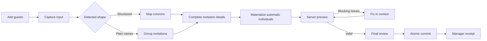
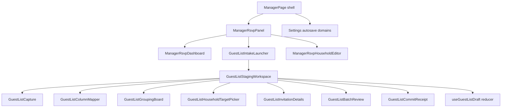

# Candidary RSVP Guest-List Intake Design

**Date:** 2026-08-01

**Status:** Design approved; written-spec and PR #10 integration corrections incorporated

## 1. Decision

Candidary will replace the host's fragmented guest-list setup experience with
one **Add guests** entry point—the approved universal quick-add action—and a
unified staging workspace.

The workspace accepts:

- the existing strict CSV format;
- mapped CSV or tabular data copied from a spreadsheet;
- a plain list containing one guest name per line; and
- one or more names typed directly.

Candidary detects whether pasted or uploaded input is structured data or a
plain name list. Detection is advisory and reversible. Structured data proceeds
through column mapping. Plain names proceed through an explicit grouping
workspace where the host selects people who share an invitation. Before server
preview, any name left ungrouped becomes an explicit individual-invitation
candidate automatically, and that result is shown in final review.

The same workspace serves later additions. It can create new households or add
named guests and plus-one capacity to an explicitly selected existing
household. It never silently synchronizes, overwrites, removes, merges, or moves
committed roster data.

All work remains staged until one final review and commit. Preview canonicalizes
and validates the fully materialized batch but writes nothing. Commit revalidates
that exact canonical batch and applies all changes in one D1 transaction or
applies none.

## 2. Product context

The current manager RSVP panel places totals, filters, export, and the household
list before setup controls. Manual creation asks the host to invent a technical
household key and enter names as newline-separated text. The strict CSV import
requires an exact schema, appears after the manual editor, and can only be used
once before any household exists and before RSVP opens.

Those paths are individually functional, but they make the host choose a data
administration method before Candidary helps with the actual job: turning a
guest list into invitations.

This design preserves the approved RSVP domain:

- hosts preload named households and explicit bounded plus-one slots;
- RSVP remains attendance-only;
- one person may respond for everyone on their household invitation;
- public lookup remains exact, rate-limited, and non-enumerating;
- attending plus-ones require a name;
- guests may edit until the deadline, after which hosts retain correction
  authority; and
- RSVP remains separate from the approved private photo journey.

## 3. Goals

- Make the empty-roster state lead directly into guest-list setup.
- Give hosts one mental model for initial setup and later additions.
- Accept common spreadsheet and plain-text sources without requiring hosts to
  read the strict CSV documentation first.
- Keep household membership explicit; never infer private relationships from a
  surname or row position.
- Make individual invitations the visible default for names the host does not
  group.
- Remove technical household-key work from ordinary manual entry.
- Keep every batch reversible before commit and atomic at commit.
- Attach validation and recovery to the exact guest or household that needs
  attention.
- Make a dropped commit response safely retryable without duplicate guests or
  ambiguous success.
- Preserve current roster limits, lookup protections, export behavior, and the
  guest RSVP and photo journeys.

## 4. Non-goals

- Recurring spreadsheet synchronization.
- Re-import that overwrites, removes, archives, or reorders committed data.
- Fuzzy public lookup, guest autocomplete, or public roster suggestions.
- Automatically inferred households based on surname, adjacency, or an AI
  model.
- Merging committed households or moving a committed invitee between them.
- Renaming, removing, reducing plus-one capacity, correcting attendance, or
  archiving from the Add guests workspace.
- Undoing a committed batch. The final review and receipt do not replace the
  existing explicit edit and archive contracts.
- Meal, dietary, accessibility, seating, contact, reminder, or invitation-
  delivery fields.
- Any change to the durable event QR or private photo upload flow.

## 5. Approved interaction decisions

The design review approved these decisions:

1. Optimize for a mixed workflow: guided initial setup followed by quick manual
   additions, while corrections remain in the dedicated household editor.
2. Accept both structured spreadsheet data and plain name lists.
3. Detect the input type and let the host override that detection without
   pasting or uploading again.
4. Use an explicit grouping workspace for plain names.
5. Convert every ungrouped name into an explicit individual-invitation candidate
   automatically before authoritative preview, then show it in final review.
6. Use one universal Add guests action for new households and additions to
   existing households.
7. Use one staging workspace rather than a long wizard or an editable
   spreadsheet clone.

## 6. Host journey



### 6.1 Entry state

A truly pristine roster leads with a **Start your guest list** card rather than
eight empty totals, search, filters, export, and a generic no-results message.
The card offers one primary **Add guests** action and makes file, paste, and
typing support clear in plain language.

Pristine means the event has never contained a household. An event with only
archived households is not pristine: it shows the normal manager view and the
additive Add guests action, but it does not regain eligibility for the strict
one-time import.

After any roster exists, Add guests remains adjacent to the **Guest list and
RSVPs** heading. Reporting and search retain their existing positions beneath
that action.

### 6.2 Capture

The first workspace step accepts:

- drag-and-drop or file selection for `.csv` and text-delimited files up to the
  existing 256 KiB (`262,144` byte) roster-source limit;
- clipboard paste from Excel, Google Sheets, or another tabular source;
- clipboard paste with one non-empty name per line; and
- direct typing for one or more guests.

When a roster already exists, capture also offers **Add to an existing
household**. A host may select the household first and add named guests,
plus-one slots, or both; a plus-one-only addition does not require a dummy name.

The browser preserves the original source in the active workspace and performs
an immediate, non-authoritative parse so it can recommend a path:

- a file or paste with consistent multi-column rows is **structured**;
- a file or paste with one non-empty parsed cell on each row is **plain names**;
  this includes one-column CSV and one-name-per-line text files; and
- ambiguous input asks the host to choose structured data or plain names.

The recommendation is always visible and changeable. Switching paths reuses the
original source rather than asking for it again.

The original source remains only in the active browser workspace. Every format,
including an exact strict CSV, is transformed locally into the candidate batch;
preview sends that batch rather than the raw file or pasted text. The source is
not persisted across browser restarts. Closing a dirty workspace, changing
manager destinations, opening Settings for repair, or navigating Back or to
another SPA route must not silently discard it. Explicit close and in-app
navigation require discard confirmation. While the workspace is dirty, ordinary
full-page unload invokes a `beforeunload` handler that requests the browser's
native pending-work warning; abrupt browser or operating-system termination
remains outside this guarantee because the draft is intentionally browser-only
and non-persisted.

### 6.3 Structured-data path

The structured path presents a sample of parsed rows and maps source columns to
these meanings:

- **Guest name** — required;
- **Household** — optional grouping value;
- **Plus-one slots** — optional, default `0`; and
- **Household key** — optional and advanced.

When Household is not mapped or a row has no household value, that guest becomes
an individual invitation. Repeated household values group rows into one staged
invitation. Repeated plus-one values for the same household must agree.
Household key may be mapped only with Household; their non-empty values must have
a consistent one-to-one relationship across the source. A key never groups rows
whose Household cell is blank.

The exact existing strict CSV header remains accepted without a mapping step:

```text
household_key,household_label,invitee_name,plus_one_slots
```

An explicitly supplied or mapped key for a new staged household is preserved at
pristine setup or later only when it is valid and unused by every committed
active or archived household and every other materialized create. A supplied
key is never rewritten or collision-suffixed; an invalid, inconsistently mapped,
or already-used key is blocking. When no key is supplied, the server generates
a stable key and may suffix that generated value to avoid a collision. Ordinary
setup never asks the host to invent or edit a key.

A supplied key or matching label never silently selects an existing household.
Candidary may show a manager-only possible match, but the host must explicitly
choose that household before the batch becomes an append. The append retains the
committed household's key and does not write the source key; review makes that
effect visible. Unconfirmed rows remain new staged households and must pass the
preserve-if-free collision checks.

### 6.4 Plain-name path

The plain-name path creates one staged person per non-empty line. It does not
group by surname, adjacency, punctuation, or an inferred relationship.

The organization workspace has two collections:

1. ungrouped people; and
2. staged invitations.

The host selects two or more people and chooses **Group as one invitation**.
Every grouping action is reversible before commit. A staged household label is
suggested from the selected display names, not from an inferred family name,
and remains editable.

When the host advances to preview, anyone left ungrouped becomes an explicit
individual-household create candidate automatically. Before that transition,
the workspace keeps those names visible as **Will become individual
invitations**; final review repeats their names and count. Automatic conversion
is never a hidden background action.

### 6.5 Direct typing and later additions

Direct typing enters the same candidate model as paste. One typed guest defaults
to a new individual invitation. Multiple typed guests can be explicitly grouped
before review.

When a roster already exists, capture and organization offer manager-only
household search. Selecting a result turns the staged people and/or plus-one
increase into an append to that exact household. Search results show enough
roster context to distinguish households but never alter the public lookup
contract. An append must add at least one named guest or one plus-one slot.

The universal workspace may:

- create new households;
- append named guests to existing households; and
- increase an existing household's plus-one capacity.

All other corrections stay in the existing household editor.

### 6.6 Invitation details

Each staged new household shows:

- an editable host-facing label;
- its named invitees;
- a plus-one control from `0` through the existing maximum of `10`; and
- the resulting invited capacity.

When a new household has no supplied key, its technical key is generated on the
server and hidden from the ordinary form. Explicitly supplied keys that pass
preview are preserved. Both forms remain stable and continue to appear in
exports for reconciliation; only generated keys may receive collision suffixes.

An append to a household that has not responded creates pending invitees and
slots. An append to a household that has responded requires an explicit
attending or not-attending answer for every new named invitee and every new
plus-one slot. An attending new plus-one also requires a name. Missing input is
blocking; it never defaults to not attending.

### 6.7 Final review and commit

Final review shows:

- new and updated household counts;
- named-guest and plus-one additions;
- total invited-capacity change;
- every automatic individual invitation;
- every target existing household;
- advisory notices; and
- blocking issues linked to the affected item.

The primary action names the exact effect, for example **Add 42 guests across 25
households**. Nothing is written before this action succeeds.

On success, a terminal manager receipt reports:

- households created;
- households updated;
- named guests added;
- plus-one capacity added;
- the new invited capacity; and
- whether the result was replayed after a retry.

The receipt offers **Return to guest list** and **Add more guests**. A successful
new household is visible even when prior filters or search would hide it: the
receipt links directly to it, while returning to the dashboard preserves the
host's earlier filters.

## 7. Workspace state and component boundaries

`ManagerPage` remains the shell and owns cross-destination pending-work and
whole-event read/write coordination. `ManagerRsvpPanel` remains the manager RSVP
coordinator, but it must not absorb the staging state. The new feature is
isolated under `src/features/rsvp/`.



Responsibilities are:

- `ManagerPage` owns the single pending-work coordinator, the router blocker,
  the `beforeunload` warning, manager-destination transitions, and the existing
  whole-event read/write guard.
- `GuestListIntakeLauncher` owns the pristine setup card and the persistent Add
  guests action.
- `GuestListStagingWorkspace` owns step navigation, focus transitions, close
  requests, and the active draft reducer. It reports whether the draft is dirty
  to `ManagerPage`; it does not install a second router blocker.
- `GuestListCapture` owns file, paste, typing, advisory detection, and source
  preservation.
- `GuestListColumnMapper` owns structured sample rows and semantic mapping.
- `GuestListGroupingBoard` owns explicit groups and automatic-individual
  preview.
- `GuestListHouseholdTargetPicker` owns manager-only existing-household search
  and explicit append targeting from either organization branch.
- `GuestListInvitationDetails` owns labels, plus-one increases, and attendance
  required for responded targets.
- `GuestListBatchReview` owns authoritative issues, totals, and commit intent.
- `GuestListCommitReceipt` owns the terminal success state and next actions.
- The draft reducer owns stable client IDs and transitions; it does not call the
  network directly.

`ManagerRsvpDashboard` continues to own totals, filters, list pagination, and
export. `ManagerRsvpHouseholdEditor` continues to own committed-roster edits,
response corrections, and archiving.

The workspace uses these explicit states:

```text
capture -> organize -> details -> materialize -> previewing -> review
        -> committing -> receipt
```

`organize` is the shared branch state, not a single component. Structured input
renders `GuestListColumnMapper`; plain-name and direct input render
`GuestListGroupingBoard`. When a roster exists,
`GuestListHouseholdTargetPicker` is available from either branch. All paths
converge on `details`.

Any state before `committing` may move backward without losing the active draft.
Preview issues return to `organize` or `details` while keeping server issue
references. A candidate or expected-version change clears the prior digest and
idempotency key. An unchanged retry preserves them.

The manager shell combines two different kinds of pending work without stacking
prompts: Settings or appearance changes that may still save, and a guest-list
draft that never autosaves. Settings or appearance work alone preserves PR #10's
internal-destination behavior: leaving Settings flushes valid scheduled drafts
and changes the destination immediately while the mounted Settings subtree
continues saving. A dirty guest-list draft pauses `openSection` destination
changes and the hidden Settings repair action for discard confirmation. When
both kinds coexist, one prompt describes both rather than opening stacked
prompts. While the guest-list draft is dirty, the prompt always offers **Stay**;
that action cancels the pending transition and keeps the current RSVP destination
and draft mounted. A Settings autosave becoming confirmed may auto-resume a
blocked route only when no dirty guest-list draft remains. Proceeding therefore
requires either an explicit guest-draft discard or a draft that has become
pristine; autosave completion alone never authorizes its loss.

Confirmed discard clears the guest-list draft before navigation; any Settings
request already sent may still settle, and the prompt says so. A Settings-repair
focus intent is armed only after that discard is confirmed and the transition
will proceed. **Stay** clears the pending repair intent, so a later ordinary
Settings click does not steal focus. A confirmed repair transition focuses the
Settings heading once, then retires the intent. Existing autosave-recovery state
survives the transition and remains visible until the affected domain actually
recovers or the host explicitly dismisses it. Route or Back navigation remains
under the shell's single blocker while either kind of work is unconfirmed.
`beforeunload` is registered on the same condition.

## 8. Shared batch contract

All capture formats converge on one normalized, JSON-serializable candidate
batch. Stable client IDs let the Worker return issues to the exact UI element.

Conceptually, the draft contains:

```ts
interface RsvpRosterBatchDraft {
  creates: Array<{
    clientHouseholdId: string;
    householdKey?: {
      value: string;
      provenance: 'supplied' | 'generated';
    };
    label: string;
    namedInvitees: Array<{
      clientInviteeId: string;
      displayName: string;
    }>;
    plusOneSlots: number;
  }>;
  appends: Array<{
    clientHouseholdId: string;
    householdId: string;
    expectedHouseholdVersion: number;
    namedInvitees: Array<{
      clientInviteeId: string;
      displayName: string;
      attendance?: 'attending' | 'declined';
    }>;
    plusOneSlotsToAdd: number;
    newPlusOneResponses?: Array<{
      clientInviteeId: string;
      attendance: 'attending' | 'declined';
      displayName: string | null;
    }>;
  }>;
}
```

For a preview request, an absent `householdKey` means **generate** and a present
value must have `supplied` provenance and means **preserve exactly or block**.
Only the Worker may introduce `generated` provenance. The canonical preview
contains a resolved value and provenance for every create, so commit can
distinguish a collision-suffixable generated key from a never-rewritten supplied
key. An append contains no source key because its explicit `householdId` and
expected version identify the committed target.

The production type names may follow existing contract conventions, but the
semantics above are required. Creates never carry attendance because a new
household has not responded. Appends to a responded household require complete
attendance data; `newPlusOneResponses` then has exactly one stable entry per
added slot. Appends to an unresponded household omit those responses and all
additions remain pending.

Issues contain:

```ts
interface RsvpRosterBatchIssue {
  clientHouseholdId?: string;
  clientInviteeId?: string;
  field: string;
  code: string;
  message: string;
  severity: 'blocking' | 'advisory';
}
```

Only informational conditions may be advisory. Capacity violations, invalid
names, same-household normalized-name duplicates, unreachable public-lookup
collisions, stale versions, incomplete responded-household attendance, and
invalid or unavailable supplied keys are blocking. A name shared across
households is not itself a duplicate error: it remains valid when the current
exact-name lookup intersection can still resolve each household with a second
invited name.

Key-related issue codes are stable and field-addressable:

- `household_key_invalid` blocks a pattern or length failure;
- `household_key_mapping_inconsistent` blocks a source that does not maintain a
  one-to-one relationship between non-empty Household and key values;
- `household_key_in_use` blocks a collision with an active, archived, or
  separate same-batch household; and
- `possible_existing_household_match` is advisory manager guidance only and
  never selects or appends by itself.

`clientHouseholdId` and every `clientInviteeId`, including a new plus-one slot,
are UUIDs that remain stable through grouping and reordering. They are UI
addresses only and are never persisted as roster identifiers.

## 9. Manager API

The unified workspace uses two new authenticated manager endpoints:

```text
POST /api/manage/events/:eventId/rsvp/roster/preview
POST /api/manage/events/:eventId/rsvp/roster/commit
```

Both routes reject a raw request body above 512 KiB (`524,288` bytes), measured
from the bytes actually received before JSON parsing or domain work. The browser
performs the same serialized-byte preflight, but the Worker remains
authoritative. This JSON-envelope limit is separate from the 256 KiB uploaded
roster-source limit. The shared constant is `MAX_RSVP_BATCH_BYTES`. A modeled
contract-maximum 500-singleton commit with
three-byte 80-character names and labels, 64-character keys, UUID client IDs,
key provenance, digest, and idempotency key is about 390 KB, leaving explicit
transport margin.
The production test fixture measures the final serialized contract rather than
assuming that estimate remains true.

The schemas allow at most 500 total target households and 500 total added
named-guest or plus-one rows, while the server still validates those additions
against remaining event and per-household capacity. Names and labels use the
existing normalized 80-character limit and must be well-formed Unicode, with
unpaired surrogates rejected; supplied household keys use the existing
64-character limit; roster identifiers and client IDs are UUIDs; and the
idempotency key is between 1 and 128 characters. Every new envelope and nested
object schema rejects unknown fields with Zod strict-object semantics; duplicate
client IDs are also rejected. Legacy request schemas retain their existing
compatibility behavior.

### 9.1 Preview

Preview accepts:

- the candidate batch;
- the event's expected roster version; and
- the expected versions already carried by append targets.

Preview performs no writes. It returns:

- the canonical candidate batch;
- the roster version it validated;
- target household versions;
- new/updated household and capacity totals;
- ordered, field-addressable issues;
- a canonical batch digest; and
- `canCommit`, which is true only when no blocking issue exists.

The Worker, not the browser, owns name normalization, household-key generation,
capacity, lookup reachability, and all authoritative validation.

For every create, preview either preserves a valid supplied key or resolves a
generated key. It checks supplied values against active households, archived
households, and separate creates in the same batch. A supplied collision blocks;
only a generated key may receive a collision suffix. Appends never acquire or
change a key.

The digest covers the event scope, canonical candidate, expected event roster
version, and every target household version. It excludes the idempotency key.

### 9.2 Commit

Commit accepts:

- the exact canonical candidate batch;
- its preview digest;
- the expected roster and target household versions; and
- an idempotency key generated when the valid review state is first reached.

After schema validation, the Worker recomputes the digest, requires it to match
the submitted preview digest, and looks up the `(event_id, idempotency_key)`
receipt before validating any mutable roster or household version. A stored
matching digest returns the original immutable receipt; a stored different
digest returns a conflict. Only an unseen key continues into current-roster
validation.

For an unseen key, the Worker revalidates the complete batch. It then applies
every create and append, increments the event roster version once, increments
every appended target household version exactly once, and writes the immutable
result receipt in one transaction. Any failure rolls back the entire batch.
If two unseen requests with the same key race, the losing failure path rereads
the receipt and replays it only when its digest matches.

The response contains:

- created household IDs;
- updated household IDs;
- the committed version of every updated household;
- committed counts;
- `committedRosterVersion`, the version produced by the original commit;
- `currentRosterVersion`, read after the commit or receipt lookup so the manager
  never replaces newer concurrency state with a replayed value;
- the same manager receipt returned on replay; and
- a `replayed` boolean.

Both version fields are equal on the original response. They may differ on a
later replay. Before another write, the workspace uses `currentRosterVersion`
and refreshes any household whose current version was not part of the immutable
receipt.

Preview is an ordinary RSVP read. Commit, including an unchanged retry that may
replay a receipt, runs through the `onEventWrite` callback already supplied by
`ManagerPage`; this invalidates any whole-event read that began before the roster
write. After success or replay, the workspace adopts `currentRosterVersion` and
`ManagerRsvpPanel` calls a dedicated
`onRosterVersionObserved(currentRosterVersion)` parent callback. `ManagerPage`
immediately merges that trusted scalar into the parent `EventView` with
`Math.max`, which also rebases the mounted hidden Settings editor. The existing
no-argument `onEventChanged` and its droppable whole-event refresh are not used
for this authoritative version transfer. A roster conflict follows the same
contract after adopting its reported current version. No batch response replaces
the whole parent event. RSVP-local household or summary refreshes remain
separate; their failure is reported without losing the parent version or turning
a committed receipt into a failure.

A concurrent Settings autosave remains safe according to server-write order,
not client response-arrival order:

- If the Settings write commits first, it does not advance the roster version,
  so the batch may still commit. If that Settings response arrives after the
  batch response, the existing Settings-owned-field merge keeps the greater
  `rsvpRosterVersion`.
- If the batch commits first, an older in-flight Settings write receives the
  existing `RSVP_ROSTER_INVALID` refusal, performs a fresh guarded read, rebases
  the dirty intent, and uses the existing one-race retry contract.
- If a dirty Settings draft has not been sent when the batch commits, the
  parent callback's new roster-version prop rebases the draft and coalesces its
  scheduled queue snapshot before it is sent, preserving the newer field
  generations.

Delayed or reversed response arrival does not change those rules. No path may
regress `rsvpRosterVersion`, discard a newer Settings field, undo the roster
batch, or make a committed batch appear unsuccessful.

### 9.3 Compatibility

The existing strict endpoints remain supported for API compatibility:

```text
POST /api/manage/events/:eventId/rsvp/import/preview
POST /api/manage/events/:eventId/rsvp/import/commit
```

They keep their current pristine-roster and RSVP-off rules and exact CSV
contract. Their parsing and validation should share lower-level domain helpers
with the batch service.

The new workspace always uses the new roster preview and commit endpoints, even
when it recognizes the exact strict CSV header. It may bypass column mapping and
reuse the strict parser, but it must produce a canonical batch and use the new
durable idempotency receipt. The legacy commit endpoint is never an internal
fallback because it cannot safely resolve a dropped commit response.

Using a file after setup is an additive batch, not another strict import. It may
create new households or explicitly append to selected households, but it never
matches and overwrites committed data on its own.

`POST /api/manage/events/:eventId/rsvp/households` also remains supported
unchanged for API compatibility, including its required client-supplied
`householdKey`. The manager application removes its manual-create caller; every
visible Add guests action uses the roster batch endpoints, so the ordinary
direct-entry UI never asks for a technical key. Existing `PUT` household editing
remains the correction path.

## 10. Worker and D1 design

A focused roster-batch service owns:

- canonical draft validation;
- supplied-key preservation and blocking, plus generated-key collision suffixes;
- same-household exact normalized-name duplicate checks;
- cross-household lookup reachability;
- event, household, named-invitee, plus-one, and total capacity limits;
- responded-household attendance completeness;
- expected roster and household versions;
- canonical digest calculation;
- idempotency receipt lookup and creation; and
- one atomic repository transaction.

It reuses existing RSVP repository mutation primitives and CSV/domain
validators where their contracts match. Repository writes remain chunked so no
D1 statement binds more than 100 parameters. The maximum supported batch fits
both the 512 KiB request envelope and the current limits of 500 households, 500
invited capacity, 20 named guests per household, 10 plus-one slots per
household, and 30 total people per household.

The next available migration adds a manager batch receipt table containing:

- `event_id`;
- `idempotency_key`;
- `request_digest`;
- the serialized immutable receipt: affected IDs, committed target versions,
  counts, and `committedRosterVersion`, excluding `replayed` and the fresh
  `currentRosterVersion` wrapper fields;
- `created_at`; and
- a foreign key that cascades on event purge.

`(event_id, idempotency_key)` is unique; keys are constrained to 1–128
characters and request digests to the canonical 64-character lowercase hex
form. A retry with the same key and digest returns the stored receipt even if
later roster changes exist. The same key with a different digest is rejected.
The receipt omits raw source, display names, and household labels. Receipts
remain until event purge, are not a revision history, and never appear in CSV
export.

## 11. Validation, errors, and recovery

### 11.1 Inline validation

The browser may immediately identify empty display names, incomplete mapping,
and locally impossible numeric values. Those checks improve feedback speed but
never enable commit without a successful server preview.

The server returns issues ordered by source position and grouped by staged
household. The workspace:

- shows a persistent issue summary;
- links each summary item to its field or card;
- moves focus to the first blocking issue after preview;
- preserves every valid staged item; and
- reruns preview after a correction rather than discarding the source.

### 11.2 Roster conflicts

For an idempotency key without an existing receipt, if the event roster version
or a target household version changes after preview, commit returns a conflict
and writes nothing. The response identifies affected targets and includes the
current roster version. A matching prior receipt is replayed before this mutable
version check.

`RSVP_ROSTER_BATCH_CONFLICT` extends the shared error envelope with a `details`
property containing typed metadata:

```ts
interface RsvpRosterBatchConflictDetails {
  currentRosterVersion: number;
  targets: Array<{
    clientHouseholdId: string;
    householdId: string;
    currentHouseholdVersion: number | null;
    state: 'changed' | 'archived' | 'missing';
  }>;
}
```

An event-only roster conflict may have an empty `targets` array. Implementation
extends the shared `ApiErrorBody`, `ApiError`, `toErrorResponse`, and
`ClientApiError` contracts so this discriminated metadata survives end to end;
it is not encoded in prose or overloaded into `fieldErrors`.

The workspace reloads current target details, keeps all unaffected staged work,
marks the affected items, and requires a new preview. It never silently rebases
an append onto a changed household. The refreshed expected versions produce a
new digest and idempotency key.

### 11.3 Uncertain network result

If the browser loses the commit response, it says that completion could not be
confirmed. It does not claim failure or success. Retrying an unchanged draft
uses the same digest and idempotency key; the Worker either performs the commit
once or replays the stored receipt.

Changing any staged content after an uncertain result clears the key and
requires a new preview, preventing one key from representing two intents.

### 11.4 File and parse failures

Unreadable, oversized, or malformed input clears any older preview from the
workspace while preserving the newly selected source when the browser can read
it. The UI never leaves an older valid preview actionable beneath a newer file
error.

The host may reselect the same corrected file. File inputs must reset in a way
that makes same-file retry observable to React and assistive technology.

If the materialized JSON exceeds 512 KiB, the workspace preserves the staged
draft, invalidates any older preview, digest, and idempotency key, and explains
that the host can split the list into smaller Add guests batches. It does not
mislabel a source file that passed its separate 256 KiB limit as oversized.

### 11.5 HTTP behavior

- Auth and permission failures keep existing manager conventions.
- A valid preview request with roster-content issues returns the preview and
  blocking issues rather than partial success.
- A raw body above 512 KiB returns `413 RSVP_ROSTER_BATCH_TOO_LARGE`; malformed
  shape returns `422 VALIDATION_FAILED`; file errors remain attached to the
  source control.
- A preview-digest, roster-version, or target-version mismatch returns
  `409 RSVP_ROSTER_BATCH_CONFLICT` with the typed details above.
- Reusing a committed idempotency key with a different digest returns
  `409 RSVP_ROSTER_BATCH_IDEMPOTENCY_CONFLICT`.
- Unexpected failures return the existing generic manager-safe message and a
  request ID; raw source rows and guest names are not copied into logs.

## 12. Security and privacy

- Every new endpoint uses existing event-manager authentication and
  authorization.
- Source bodies and normalized drafts are never written to application logs.
- Manager-only collision guidance does not change public lookup responses.
- Public RSVP lookup stays exact, generic on failure, rate-limited, and
  non-enumerating.
- No fuzzy matching or relationship inference decides committed membership.
- Technical keys remain internal identifiers, not guest credentials.
- Manager batch receipts are not exported and are deleted with the event.
- The design does not change durable-entry, guest-session, RSVP-submission, R2,
  or photo-upload secrets.

## 13. Accessibility and responsive behavior

The workspace is a full-width manager region on desktop and a single-column
full-screen surface on narrow devices. It must work at 320 px, 390 px, and 200%
zoom without page-level horizontal scrolling.

Requirements include:

- minimum approved touch-target sizing for all grouping and navigation actions;
- a keyboard-operable grouping alternative that does not depend on drag and
  drop;
- programmatic step headings and current-step announcements;
- focus placement on step entry, preview failure, conflict refresh, and receipt;
- field-associated errors and a linked error summary;
- live regions that distinguish committed success from a failed refresh after
  success;
- manager-level autosave and recovery notices remain perceivable in the narrow
  full-screen workspace without obscuring its primary action or stealing focus
  when they appear in the background;
- **Open settings** from such a notice uses the shared pending-work coordinator
  and cannot bypass guest-list discard confirmation;
- contained scrolling for long source samples, household lists, and issue lists;
- visible selected state that does not rely on color alone; and
- long names, labels, and translated messages that wrap without hiding actions.

## 14. Verification strategy

Implementation follows task-by-task TDD: a failing test precedes each production
change, and independent tasks receive independent commits.

### 14.1 Shared and unit tests

- structured-versus-plain advisory detection;
- one-column CSV and text-file plain-name detection;
- ambiguous-input override without source loss;
- CSV, TSV, clipboard, and direct-entry normalization;
- column mapping and unmapped-household individual defaults;
- explicit grouping and ungroup operations;
- automatic materialization of remaining names before server preview;
- stable client IDs and draft reducer transitions;
- canonical digest stability and change detection;
- field-addressable issue mapping;
- one-to-one Household/key mapping validation; and
- preserve-if-free supplied keys versus generated-key collision suffixing.

### 14.2 Worker tests

- preview performs no writes;
- strict CSV behavior remains unchanged;
- initial and incremental additive batches;
- explicit existing-household selection;
- no silent matching by label or key;
- supplied-key preservation during initial and later creates;
- supplied-key collision blocking against active, archived, and same-batch
  households, with no automatic suffixing;
- duplicate and public-lookup reachability validation;
- event and household capacity boundaries;
- responded-household attendance requirements;
- atomic rollback for a late batch failure;
- roster and household version conflicts;
- cross-route server-write ordering: Settings-first leaves the roster version
  unchanged and permits the batch, while batch-first makes the stale Settings
  PATCH return `RSVP_ROSTER_INVALID`;
- same-key/same-digest receipt replay;
- same-key/changed-digest rejection;
- concurrent same-key commit race replay;
- a lost-response retry after later roster edits;
- replay returns the immutable committed version and a fresh current roster
  version;
- exact 512 KiB request-envelope enforcement before JSON parsing, including a
  contract-maximum serialized fixture that remains below the cap;
- rejection of ill-formed Unicode before text canonicalization;
- strict unknown-field rejection at the envelope, create/append,
  household-key, invitee, and plus-one-response layers while legacy schemas
  remain unchanged;
- typed roster-conflict metadata through the Worker and client transport;
- event purge cascades manager receipts;
- spreadsheet-formula protections in current export remain unchanged; and
- the 500-capacity batch with no prepared statement above 100 bindings.

### 14.3 UI tests

- pristine setup replaces irrelevant reporting controls;
- archived-only events do not regain strict-import eligibility;
- every input mode and detection override;
- structured mapping and source preservation;
- explicit grouping and automatic individuals;
- existing-household targeting from structured and plain-name organization;
- new-household and existing-household quick additions;
- plus-one-only additions to an explicitly selected existing household;
- no required technical-key input in direct entry, while advanced structured
  column mapping remains optional;
- plus-one assignment and responded-household attendance;
- inline issue links and focus;
- stale preview and version-conflict recovery;
- unreadable and same-file retry behavior;
- old-preview invalidation after new source failure;
- oversized-batch recovery without losing the staged draft;
- close/discard confirmation from explicit close, manager-section changes,
  Settings repair, and SPA route or Back navigation, plus `beforeunload`
  listener registration and removal and a cancellation request while dirty;
- one combined pending-work prompt when Settings or appearance work and a dirty
  guest-list draft coexist, with no second router blocker;
- no route auto-proceed when Settings finishes but a guest-list draft remains
  dirty, and **Stay** remaining available for that draft;
- Settings-only internal destination changes preserving PR #10's immediate
  navigation and background-save behavior;
- Settings-repair focus arming only after confirmed discard, clearing on
  **Stay**, remaining one-shot after transition, and ensuring neither **Stay**
  nor **Open settings** clears the recovery notice;
- preview remaining outside `onEventWrite` while commit, retry, and replay use
  it;
- success, replay, and conflict immediately propagating
  `currentRosterVersion` through `onRosterVersionObserved` and a monotonic
  `Math.max` parent merge;
- both server-write orders between a roster batch and a Settings autosave,
  delayed response orders, an in-flight refusal/rebase/retry, and an unsent dirty
  draft rebasing from the parent version;
- narrow-workspace manager notices that do not move focus, plus guarded **Open
  settings** recovery;
- uncertain commit retry and replayed receipt; and
- direct access from the receipt to newly created or updated households.

### 14.4 Browser tests

- complete initial paste journey and later quick-add journey;
- file input and clipboard paste using real browser transport;
- 320 px and 390 px layouts;
- 1280 px at 200% zoom;
- keyboard-only grouping, mapping, review, and issue navigation;
- internal destination changes and Settings-repair navigation preserving a dirty
  draft on **Stay** and discarding it only after confirmation;
- touch targets and contained internal scrolling;
- accessibility scans for capture, grouping, errors, review, and receipt;
- maximum household and long-name/error fixtures;
- no public roster data before an exact lookup match;
- unchanged guest RSVP journey; and
- unchanged photo-first and photo-upload journeys.

### 14.5 Load rehearsal

The guarded RSVP load rehearsal exercises the new roster batch preview and
commit path with a maximum-capacity disposable event, asserts that the payload
stays below 512 KiB, reconciles committed totals, and verifies receipt replay.
Legacy strict-import behavior remains covered in Worker compatibility tests. If
the existing harness retains a legacy mode, the new-batch rehearsal uses an
explicit separate mode or script so neither path is mislabeled.

## 15. Acceptance criteria

The design is ready for release consideration only when all of these are true:

1. A pristine event leads with guest-list setup rather than empty reporting.
2. A host can paste representative structured data, correct mapping, and reach a
   valid preview without consulting the strict CSV documentation.
3. A host can paste plain names, explicitly group shared invitations, and see
   all remaining names become explicit individual candidates before preview and
   individual invitations in final review.
4. A later single-household addition never asks for a technical key in the
   ordinary manager UI.
5. An explicitly supplied key for a new household is preserved when free,
   blocks when invalid or already reserved, and never selects an existing
   household by itself.
6. A file used after setup is additive only and cannot silently overwrite or
   remove committed data.
7. No preview writes data, and no failed commit leaves a partial batch.
8. A dropped commit response can be retried without duplicate guests or an
   ambiguous result.
9. Every blocking issue is linked to its affected staged item and is reachable
   by keyboard and assistive technology.
10. The maximum supported roster fits the 512 KiB JSON envelope and respects
    D1's binding limit and current domain limits.
11. Public lookup protections, RSVP attendance semantics, the durable QR, and
    the private photo journey remain unchanged.
12. No manager destination, Settings-repair action, SPA navigation, or Back
    action can silently discard a dirty staging workspace. While dirty, an
    ordinary full-page unload requests the browser's native pending-work warning;
    the browser controls its presentation, and abrupt browser or operating-system
    termination remains outside the guarantee.
13. Batch commit participates in the manager event-write guard and propagates
    the current roster version without regressing or discarding concurrent
    Settings work.

## 16. Implementation and release boundaries

- Implementation must use failing tests before production changes.
- Work should be split into independently reviewable commits.
- Existing unrelated dirty and untracked files must remain untouched.
- The implementation task that adds
  `RSVP_ROSTER_BATCH_TOO_LARGE`, `RSVP_ROSTER_BATCH_CONFLICT`, and
  `RSVP_ROSTER_BATCH_IDEMPOTENCY_CONFLICT` must update `shared/errors.ts` and
  document all three codes in `docs/operations.md`; the typed conflict-detail
  contract must be updated on both server and client in that task.
- `docs/rsvp-csv.md` must distinguish universal additive Add guests intake from
  the preserved one-time strict-import API and document preserved or generated
  household keys in exports.
- `docs/operations.md` must also replace its one-time-import-only intake and
  legacy load-harness narrative with the new additive-batch and rehearsal
  contracts while retaining the strict API's compatibility boundary.
- The historical Task 9 section in
  `docs/superpowers/plans/2026-07-30-event-rsvp-and-durable-entry.md` remains a
  record of the first manager UI, but must point future intake work to this
  design and PR #10's shell contracts rather than its original interface and
  visible setup paths.
- Do not push without asking first.
- Do not deploy, apply remote D1 migrations, alter remote D1 or R2 data, or set
  or store secrets without explicit authorization.
- Source completion, PR merge, migration application, Cloudflare deployment,
  and live browser verification are separate claims and gates.
- The visual-companion artifacts under `.superpowers/` are ignored working
  material, not product source or release evidence.

## 17. Design review record

The conversational design review approved:

- the mixed initial-and-later workflow;
- both structured and plain-name input;
- explicit grouping workspace option B;
- automatic individual invitations for ungrouped names;
- the universal Add guests action;
- the unified staging journey;
- the validation, atomic commit, idempotency, and recovery model; and
- the component, API, scope, and verification boundaries in this document.

The written-spec review against the current RSVP source then resolved:

- the separate 256 KiB source and 512 KiB JSON-envelope limits;
- preserve-if-free supplied keys with blocking active, archived, and same-batch
  collisions;
- the legacy manual-create endpoint's compatibility-only role;
- strict new schemas and typed conflict metadata;
- operations and CSV documentation obligations; and
- maximum-capacity load coverage for the new batch path.

The post-merge review of PR #10 then added:

- one manager-shell pending-work coordinator for Settings autosave and the
  non-autosaving guest-list draft;
- explicit protection for internal destinations, Settings repair, and route and
  Back navigation, plus the native warning for ordinary page unload;
- `onEventWrite` ownership for roster commit plus an authoritative scalar
  callback and monotonic parent-event version merge after success, replay, or
  conflict;
- deterministic server-write and response-arrival rules for concurrent Settings
  autosave and roster batch writes; and
- a supersession boundary for the historical Task 9 implementation record.

This document is the design source for the next implementation-planning phase.
It does not authorize application changes, pushing, deployment, remote
migrations, data mutation, or secret management.
